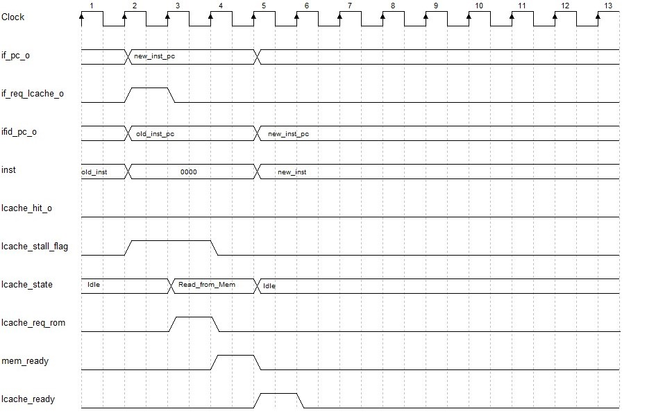
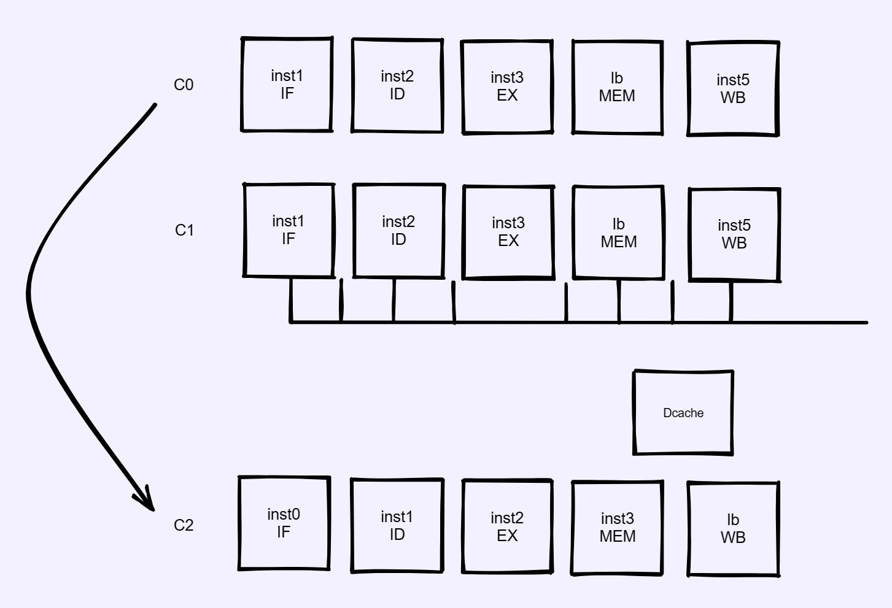
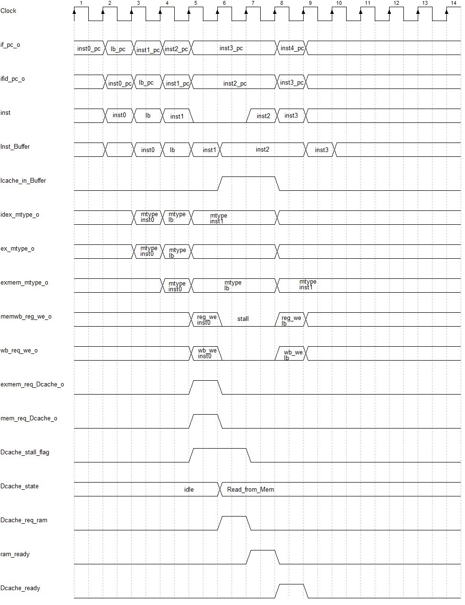

#  特别注意
设计中，流水线在stall时停滞，在stall复位的下一个周期传递新数据。

## 注意
所有的流水线控制，包括数据的交付等，都应该由流水线寄存器来完成。    
流水线部件应完成的是根据流水线寄存器给的数据进行操作。    

比较特殊的有IF、ID、WB。    
其中IF，本身内部主要为时序逻辑，类似一个流水线寄存器。   
其中ID，inst给出部分，本不应该集成在ID模块内部，因为ID应该直接只接收指令，而指令的选择性给出，应该由流水线寄存器完成。   

特例还有ID、WB分别设计Icache和Dcache的stall问题，所以需要控制信号直接控制，是否存储在Buffer中。   

流水线寄存器停顿操作中比较特殊的有：    
本身停顿操作完成的是`x_o <= x_o`，但是，对于Icache和Dcache的req操作，在停顿时，不应该再次req，所以，分别对于IF和ex_mem_reg，在stall有效时，req都为0。   

---

1. 为什么流水线寄存器不需要Buffer缓冲前一个数据：
   - Icache_stall:    
    Icache_stall需要保持的只有IF和ifid流水线寄存器，ID中的inst不应保持，而是在当前ID中有效指令往后流动后，ID中的inst就保持为0,不会对机器状态产生影响。   

        由于FC中的Icache_stall_flag在if_pc_o改变的时刻就会一起改变，此时所有的机器状态都处于if_pc_o刚改变的第一个周期，即周期2。    

        而在周期4时就变为0,即ID得到新inst的前一个周期，这能保证，在周期5的上升沿，所有状态可以开始改变，即在周期5回到流水线正常状态。

    
        
			<!--块级封装-->
        
	<!--将图片和文字居中-->
        
         		<!--换行-->
                    <!--标题-->
        

        

     - IF中的if_pc_o在周期2时刚改变为新inst的pc，此时由于Icache_stall，所以保持当前pc即可。
     - if_id_reg中的ifid_pc_o此时还是旧inst的pc，这就是stall的意义，流水线寄存器的输出保持不变，在导致stall的事务完成后，流水线寄存器才输出新值。     
           
    ---

      - Dcache_stall:   
        Dcache_stall需要保持所有机器状态，直到Dcache给出数据。   
        
			<!--块级封装-->
        
	<!--将图片和文字居中-->
        
         		<!--换行-->
                    <!--标题-->
        

        
   
        如图可以看出，从C0阶段到C2阶段，是流水线正常执行的过程，而C1阶段需要停滞包括：IF、ifid、ID、idex、exmem、MEM、memwb、WB一系列数据，同时在C2阶段开始的第一个周期，流水线同步流动。     

        
			<!--块级封装-->
        
	<!--将图片和文字居中-->
        
         		<!--换行-->
                    <!--标题-->
        

        
   
 
        此设计中的关键在于，用Inst_Buffer解决Icache与Dcache协调的问题。   
        在clk5的上升沿，inst本应为inst2，但此时由于Dcache_stall，inst强制置为0,所以应保存inst2,在stall置位时恢复inst2,所以在Icache_valid和stall皆有效时，将Icache_inst_i存入Inst_Buffer，并在stall置位时将Inst_Buffer恢复进ID模块，以此恢复inst2的功能。
     