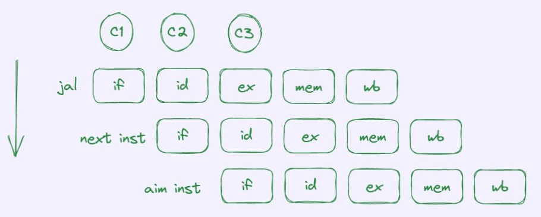

## 端口信号
### Input 
1. input wire   [31:0]  regs_reg1_rdata_i
   input wire   [31:0]  regs_reg2_rdata_i
   来自寄存器组，在当前周期获取当前指令需要的寄存器值。   
2. input wire           dhnf_hazard_sel1_1    
   input wire           dhnf_hazard_sel2_1   
   来自dhnf模块，判断应该选择寄存器数据还是前递的数据。
   input wire   [31:0]  dhnf_forward_data1_i
   input wire   [31:0]  dhnf_forward_data2_i
   来自dhnf模块，前递数据。
3. input wire   [31:0]  Icache_inst_i   
   来自Icache模块，指令。   
4. input wire           fc_jump_flag_i   
   来自Flow_Ctrl模块，表明当前id阶段中的指令需要冲刷，即打拍的指令寄存器输出为0。   
### Output
1. output wire [4:0]    id_reg_waddr_o
   output wire          id_reg_we_o
   译码中分解出的写回地址，在后续阶段中需要使用。    
   
2. output wire          id_btype_flag_o
   output wire [31:0]   id_btype_jump_pc_o   
   只告诉后续模块，该条指令是btype，ex阶段若判断branch条件成立，就使用该pc信息。     

3. output wire          id_reg1_RE_o
   output wire          id_reg2_RE_o
   传递给dhnf模块，只有在当前指令需要读寄存器时，才需要判断是否需要使用数据前递。     

4. output wire          id_jump_flag_o
   output wire [31:0]   id_jump_pc_o
   传递给fc模块，该条指令是否为跳转指令。    

## 内部信号
1. reg delay_flag   
   用于btype和jtype的跳转指令清空id段内容，即清除某些指令。    
   由于某条指令一般只能影响所在的流水线部件的逻辑功能，所以当跳转指令需要使下一条指令的inst为32'h0，那么就需要一个打一拍的寄存器来作为下周期进行该操作的标志。

   
   过程：
   
			<!--块级封装-->
    
	<!--将图片和文字居中-->
    
     		<!--换行-->
            	<!--标题-->
    

          
   
			<!--块级封装-->
    
	<!--将图片和文字居中-->
    
     		<!--换行-->
            	<!--标题-->
    

   
   在C2周期时，id部件判断出该指令为jtype指令，同时在if部件中的指令为next inst。        

   
   由于需要跳转，所以下一条指令不能发生作用，需要清除，清除方式可以使用，next inst进入到id部件时，读出的指令为32'h0，即可消除该指令后续对机器状态的影响。        

   
   在下一周期，即C3周期，if部件取得的指令就应为跳转的目标指令。     

# 模块功能
1. 获取op_a和op_b，其中op_a主要为寄存器数据或根据特殊指令的特殊值，op_b主要为寄存器数据或立即数或根据特殊指令的特殊值。  
   特殊值对有：   
   Lui（op_a = 32'h0，op_b = eximm）
   Auipc（op_a = PC，op_b = eximm）
   Jal,Jarl（op_a = PC，op_b = 4） //将PC+4写入xd寄存器
   SLLI，SRLI，SRAI（op_a = reg_a，op_b = shamt）  
   
   
2. 将指令译码给cu模块   
   一条指令译码分解为opcode、rs1、rs2、rd、func3、func7、shamt。     
   将后续阶段中需要使用的信息分解出来并传递。     

3. 立即数扩展

4. 判断是否为Jal，Jarl指令，若是，则向Flow_Ctrl模块申请Jtype跳转。   

   
   
   
   