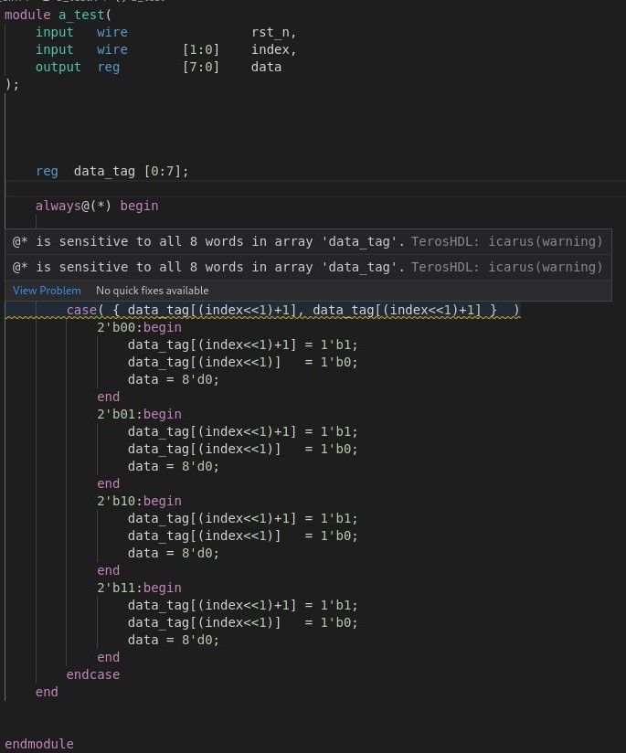

# 语法及小细节
1. verilog默认的寄存器类型和线网类型的值是无符号的。（reg signed 可以定义有符号值）  
   所以在做算术右移时，若直接`op_a >>> 2`，只会在最左边补零。   
   所以若是有符号数的算术右移，就需要`($signed(op_a)) >>> 2`。    

---

2. 为什么组合逻辑中不能有非阻塞赋值：   
   非阻塞赋值`<=`指在某个时间，某个或某些操作发生，而组合逻辑不能作时间上的控制。

---
3. $\orange{always@(*)的敏感列表}$：   
    敏感信号列表出现在always块中，其典型行为级的含义为：只要敏感信号列表内的信号发生电平变化，则always模块中的语句就执行一次，因此设计人员必须将所有的$\blue{输入信号}$和$\blue{条件判断信号}$都列在信号列表中。   

    有时不完整的信号列表会造成不同的仿真和综合结果，因此需要保证敏感信号的完备性。   
    
    always@(*)将所有的$\blue{输入信号和条件判断信号}$作为触发信号自动包括进敏感列表。
   
    ## 异常情况
    然而在如下情况中，data_tag是一个二维的存储器。想实现的功能是，当index的值变化时，由data_tag中对应存储的值来决定转移值。  
    若直接使用always@(*)，输入信号都是常量，条件判断信号为case中的`{ data_tag[(index<<1)+1], data_tag[(index<<1)+1] }`，其值会在data_tag或index发生变化时改变，即敏感列表中包括data_tag这个存储器阵列（word就代表存储器个数）和index信号。

    然而在此种情况中，data_tag同时也是左值，即会被改变的值，若data_tag作为左值被改变，则又会引起always块再次激发，导致得到的不是想要的结果。    

    对于这种情况，可以手动设置敏感列表，将always@(*)修改为always@(index)。

    
			<!--块级封装-->
    
	<!--将图片和文字居中-->
    
     		<!--换行-->
            	<!--标题-->
    

---

4. 对于3位信号`3'b100`