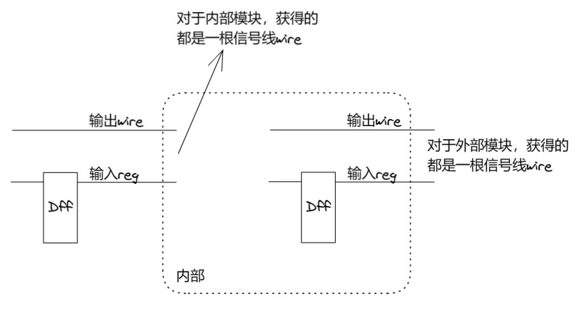

# 模型相关

## wire和reg作为内部变量的区别   

wire无法被内部模块直接改变，只能由外部驱动改变。  
reg可以由模块内部直接改变。   

---

## $\orange{端口}$    
直观地将wire考虑成线，输出完全由输入驱动；  
将reg考虑成一个D触发器或锁存器，能保持输出值。

所有端口隐含设置为wire类型，需要显式地设置成reg类型。  
  
### $\orange{输入输出端口}$  
从模块内部考虑，从外部来的信号总可以抽象为一条信号线，即wire类型;  
输出到外部的数据可以保持（reg）或不保持（wire）。   

从模块外部考虑，从某模块输出的信号总可以抽象为一条信号线，即wire类型;   
输出到莫个模块的数据可以保持（reg）或不保持（wire）。

			<!--块级封装-->
    
	<!--将图片和文字居中-->
    
     		<!--换行-->
    输入输出端口模型	<!--标题-->
    

---

## 各级建模
门级：用与或非门，逻辑门来构建整个电路。   
数据流：用逻辑符号来构建电路。   
行为级：包含结构化模块always、initial，包含赋值语句，基于事件的时序控制，电平敏感的时序控制，条件语句、分支语句、循环语句等。不必涉及硬件实现的细节。

---
   
   
